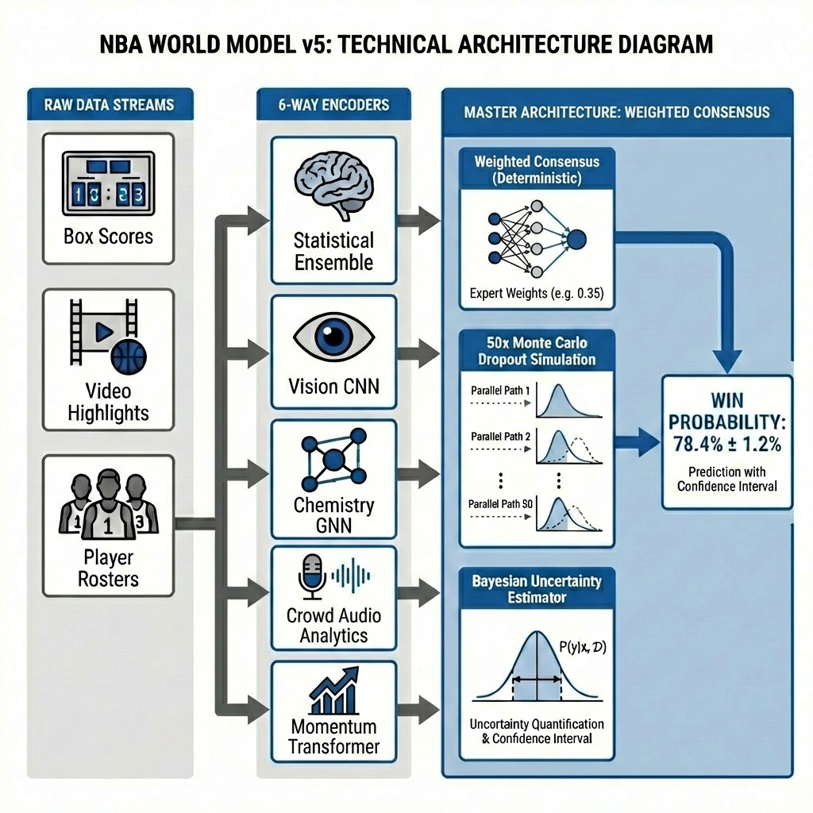

# NBA World Model v5 - Technical Architecture

## Overview

The **NBA World Model v5** is a multi-modal, explainable AI system for NBA game prediction. It combines classical machine learning, deep learning, and real-time video analysis into a unified prediction framework.



---

## Architecture Components

### Raw Data Streams (4 Inputs)

| Data Stream | Description | Source |
|-------------|-------------|--------|
| **Box Scores** | Historical game statistics, ELO ratings, win/loss records, rest days | `nba_games_enhanced.csv` |
| **Video Highlights** | YouTube game highlight videos for visual and audio analysis | NBA Official Playlists (via yt-dlp) |
| **Player Rosters** | Team composition and synergy data (progressive) | Chemistry scores calculated from past 10 games |


---

### 6-Way Encoders

| Encoder | Input | Output | Implementation |
|---------|-------|--------|----------------|
| **Statistical Ensemble** | Box Scores | Base Win Probability (0-1) | XGBoost + LightGBM + CatBoost with Isotonic Calibration |
| **Momentum Transformer** | Season Trajectory | Momentum Delta (±0.05) | Attention-based Transformer V2 (Time-series) |
| **Vision CNN** | Video Frames | Vision Delta (±0.05) | MobileNetV3, trained on real NBA highlight videos |
| **Chemistry GNN** | Player Rosters | Chemistry Delta (±0.05) | Progressive synergy score from last 10 games (consistency + form) |
| **Optical Flow Analysis** | Video Frames | Flow Delta (±0.05) | OpenCV Farneback optical flow (game intensity) |
| **Crowd Audio Analytics** | Video Audio | Audio Delta (±0.05) | MLP classifier on Mel-frequency spectrograms |

---

### Master Architecture: "Weighted Consensus"

The **Weighted Consensus** (previously Expert Referee) is a deterministic fusion module.

```
Final Probability = Base Probability + Σ(Weight_i × Delta_i)
```

**Key Components:**

1.  **Weighted Consensus**: A deterministic module that applies expert-defined weights (e.g., Vision=0.35, Momentum=0.25) to each modality's delta.
2.  **Residual Skip-Connection**: The Statistical Ensemble output serves as a "Conservative Anchor," ensuring predictions never deviate too far from the strong baseline.
3.  **Monte Carlo Perturbation**: The fusion module input is perturbed 50 times to simulate sensitivity and estimate uncertainty.
4.  **Bayesian Uncertainty Estimator**: The standard deviation of the 50 samples provides a confidence interval (e.g., `78.4% ± 1.2%`).

---

## Data Flow (Progressive Evaluation)

To ensure **no data leakage**, the model operates in a strict time-series manner:

1.  **Warm-Up**: All games before the evaluation period are processed to initialize ELO and team states.
2.  **Prediction**: For each game `G` on date `D`:
    *   Only data from dates `< D` is used.
    *   Vision CNN analyzes videos from the team's *past* games (not the current game).
    *   Chemistry is calculated from the team's *past* 10 games (not full season).
3.  **Update**: After prediction, the actual result of game `G` is added to the world state for future games.

---

## File Structure

| Component | File Path |
|-----------|-----------|
| Statistical Ensemble | `src/models/pregame/train_ensemble.py` |
| Vision CNN | `scripts/training/train_vision_real.py` |
| Chemistry GNN | `src/models/chemistry_gnn.py` |
| Optical Flow | `scripts/eval/streaming_world_model_eval.py` (integrated) |
| Audio Analytics | `src/models/vision/audio_analytics.py` |
| Expert Fusion | `src/models/fusion/learnable_fusion.py` |
| Momentum Transformer | `src/models/momentum/momentum_transformer.py` |
| Full Evaluation | `scripts/eval/streaming_world_model_eval.py` |

---

## Getting Started

```bash
# Install dependencies
poetry install

# Run full evaluation (2024-25 & 2025-26 seasons)
poetry run python scripts/eval/streaming_world_model_eval.py --season all
```
