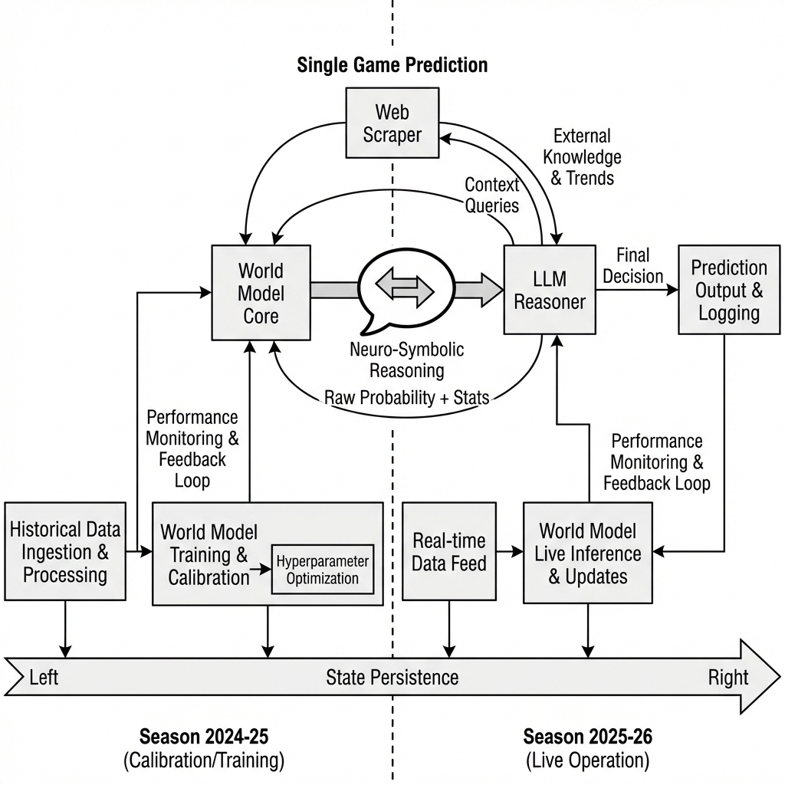

# specialized_system_architecture.md

# specialized_system_architecture.md

# specialized_system_architecture.md

## 1. Temporal Progression: 2024-25 $\to$ 2025-26
The system is continuous. It does not simply "start" in 2025.
*   **Season 2024-25 (Left)**: Used for calibration and establishing latent states (Momentum, Chemistry).
*   **State Persistence (Arrow)**: These states are carried over (not reset) into the current season.
*   **Season 2025-26 (Right)**: Live, game-by-game predictions where the model continues to learn.

## 2. The Neuro-Symbolic Dialogue (Center Loop)
You asked: *"How does the LLM talk to the World Model?"*

The interaction is not a one-way street; it's a **Validation Loop**:

1.  **WM $\to$ LLM ("The Proposal")**:
    *   *World Model*: "I calculate a **72%** chance of victory. My confidence is high based on recent shooting variance."

2.  **LLM $\to$ Context ("The Verification")**:
    *   *LLM*: "Let me check the news." (Queries Web Scraper)
    *   *Result*: "Breaking: Starting Center ruled out 10 minutes ago."

3.  **LLM $\to$ WM ("The Override")**:
    *   *LLM Logic*: "Your 72% calculation assumes the Center plays (because he played in previous data). This assumption is now false."
    *   *Decision*: "I am overriding the physics simulation with this semantic fact."
    *   *Result*: "Adjusted Probability: **55%**."

This structure allows the **World Model** to be the "Engine" (efficient, mathematical) and the **LLM** to be the "Driver" (aware of the road conditions).

## 3. The Role of the LLM (Reasoning Layer)
The **World Model** provides the physics simulation ($P(win)$). The **LLM** provides the contextual understanding ($R$).

*   **Quantitative Input**: "Model predicts 82% win probability based on stats and video."
*   **Qualitative Input**: "Breaking News: Star Player suspended indefinitely."
*   **LLM Action**:
    1.  **Parse**: Identify "Suspension" as a high-impact negative event.
    2.  **Reason**: "This event invalidates the statistical prior (82%)."
    3.  **Adjust**: "Penalty applied: -25%. New Probability: 57%."
    4.  **Explain**: Output text reasoning for the user/bettor.
