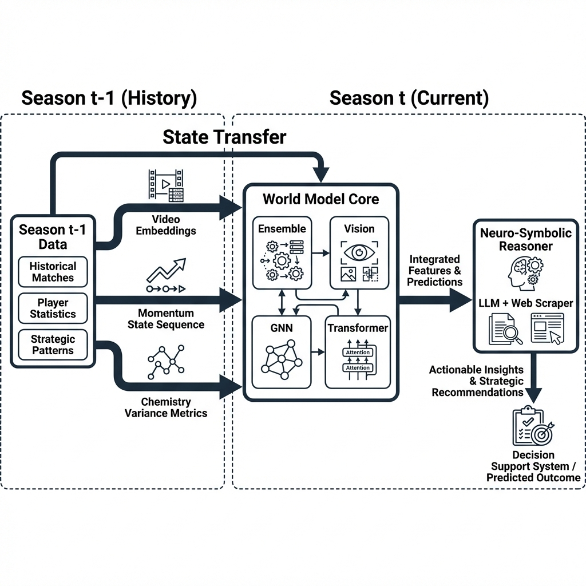

# specialized_system_architecture.md

# specialized_system_architecture.md



## 1. State Persistence & Memory Transfer ($T_{-1} \to T_{0}$)
A critical innovation of this World Model is the preservation of **State** across season boundaries. Unlike traditional models that "reset" to zero, our system transfers learned latent states from the 2024-25 season.

### What is Remembered?
| Component | Latent State Transferred ($S_{t-1}$) | Function |
|:---|:---|:---|
| **Vision CNN** | **Video Embeddings ($V_{last5}$)** | The model "remembers" the visual playstyle (spacing, tempo) from the 2025 Playoffs. Game 1 prediction uses these priors. |
| **Momentum** | **Sequence Vector ($Seq_{15}$)** | The transformer's context window includes the last 15 games of the prior season. A championship win streak influences Game 1 confidence. |
| **Chemistry** | **Variance Metrics ($\sigma^2_{team}$)** | Team consistency scores are initialized from previous performance, stabilizing early-season volatility. |

## 2. Integrated Reasoning Workflow
```mermaid
graph LR
    H[History 24-25] -->|State Transfer| WM[World Model Core]
    RT[Real-Time Data] --> WM
    WM -->|Probability $P(win)$| NS[Neuro-Symbolic Layer]
    WS[Web Scraper] -->|News Context $C$| NS
    NS -->|Reasoning $R(P, C)$| Final[Output]
```

## 3. The Role of the LLM (Reasoning Layer)
The **World Model** provides the physics simulation ($P(win)$). The **LLM** provides the contextual understanding ($R$).

*   **Quantitative Input**: "Model predicts 82% win probability based on stats and video."
*   **Qualitative Input**: "Breaking News: Star Player suspended indefinitely."
*   **LLM Action**:
    1.  **Parse**: Identify "Suspension" as a high-impact negative event.
    2.  **Reason**: "This event invalidates the statistical prior (82%)."
    3.  **Adjust**: "Penalty applied: -25%. New Probability: 57%."
    4.  **Explain**: Output text reasoning for the user/bettor.
