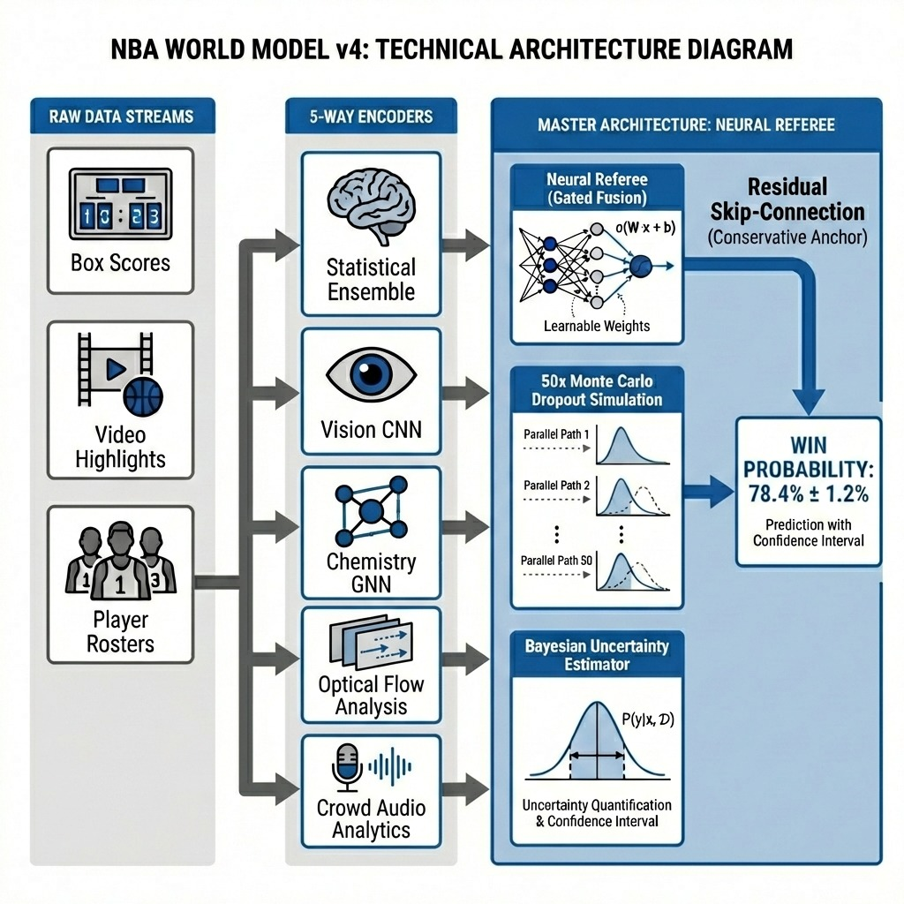

# NBA World Model v4 - System Architecture



## Component Summary

### Raw Data Streams
1. **Box Scores**: Historical game statistics, ELO ratings, win/loss records
2. **Video Highlights**: YouTube game highlights for visual/audio analysis
3. **Player Rosters**: Team synergy data (calculated progressively from past 10 games)

### 5-Way Encoders
| Encoder | Output |
|---------|--------|
| **Statistical Ensemble** | Base Win Probability |
| **Vision CNN** | Visual Form Delta |
| **Chemistry GNN** | Team Synergy Delta |
| **Optical Flow Analysis** | Game Intensity Delta |
| **Crowd Audio Analytics** | Crowd Momentum Delta |

### Master Architecture: Neural Referee
- **Gated Fusion**: Learns to weight each modality dynamically
- **Residual Skip-Connection**: Preserves Statistical Ensemble as anchor
- **50x Monte Carlo Dropout**: Samples posterior for uncertainty
- **Bayesian Estimator**: Outputs confidence interval (e.g., `78.4% ± 1.2%`)

## Data Flow (No Leakage)

```
For each game G on date D:
1. ONLY use data from dates < D
2. Vision CNN analyzes PAST game videos (not current game)
3. Chemistry uses PAST 10 games (not full season)
4. AFTER prediction, update world state with actual result
```

## Key Files
- `src/models/pregame/train_ensemble.py` - Statistical Ensemble
- `src/models/fusion/learnable_fusion.py` - Gated Fusion
- `src/models/chemistry_gnn.py` - Chemistry GNN
- `src/models/vision/audio_analytics.py` - Audio Analytics
- `scripts/streaming_world_model_eval.py` - Full Evaluation
